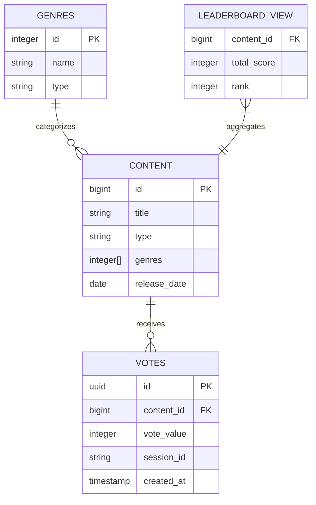

# Data Model: WRWW Voting Leaderboard

## Entity Definitions

### 1. Movie/TV Show
**Table**: `content`
```typescript
interface Content {
  id: number;              // TMDB ID (primary key)
  title: string;           // Display title
  type: 'movie' | 'tv';    // Content type
  poster_path: string;     // TMDB poster URL path
  backdrop_path?: string;  // Background image
  overview: string;        // Description (max 500 chars)
  genres: number[];        // Array of genre IDs
  release_date: Date;      // Release/first air date
  rating: number;          // TMDB rating (0-10)
  vote_count: number;      // TMDB vote count
  popularity: number;      // TMDB popularity score
  cached_at: Date;         // When data was fetched
  updated_at: Date;        // Last update timestamp
}
```

### 2. Vote
**Table**: `votes`
```typescript
interface Vote {
  id: string;              // UUID (primary key)
  content_id: number;      // Foreign key to content
  vote_value: -1 | 0 | 1;  // Vote: -1 (left), 0 (up), 1 (right)
  session_id: string;      // Browser session identifier
  ip_hash?: string;        // Hashed IP for fraud detection
  user_agent?: string;     // Browser fingerprint component
  created_at: Date;        // Vote timestamp
}
```

### 3. Genre
**Table**: `genres`
```typescript
interface Genre {
  id: number;              // TMDB genre ID (primary key)
  name: string;            // Genre name
  type: 'movie' | 'tv';    // Applicable content type
}
```

### 4. Leaderboard (Materialized View)
**View**: `leaderboard_view`
```typescript
interface LeaderboardEntry {
  content_id: number;      // Foreign key to content
  title: string;           // Content title
  poster_path: string;     // Poster for display
  type: 'movie' | 'tv';    // Content type
  total_score: number;     // Sum of vote_values
  positive_votes: number;  // Count of +1 votes
  negative_votes: number;  // Count of -1 votes
  neutral_votes: number;   // Count of 0 votes
  rank: number;            // Position in category
  genre_ids: number[];     // For filtering
  last_voted: Date;        // Most recent vote
}
```

### 5. Session
**Client-side Storage** (not database)
```typescript
interface SessionData {
  session_id: string;      // UUID generated on first visit
  voted_content: Map<number, {
    vote_value: -1 | 0 | 1;
    voted_at: Date;
  }>;                      // Track user's votes
  created_at: Date;        // Session start time
}
```

## Database Schema (Supabase/PostgreSQL)

```sql
-- Content table (movies and TV shows)
CREATE TABLE content (
  id BIGINT PRIMARY KEY,
  title TEXT NOT NULL,
  type TEXT CHECK (type IN ('movie', 'tv')) NOT NULL,
  poster_path TEXT,
  backdrop_path TEXT,
  overview TEXT,
  genres INTEGER[] DEFAULT '{}',
  release_date DATE,
  rating DECIMAL(3,1),
  vote_count INTEGER DEFAULT 0,
  popularity DECIMAL(10,2),
  cached_at TIMESTAMP WITH TIME ZONE DEFAULT NOW(),
  updated_at TIMESTAMP WITH TIME ZONE DEFAULT NOW()
);

-- Indexes for content
CREATE INDEX idx_content_type ON content(type);
CREATE INDEX idx_content_genres ON content USING GIN(genres);
CREATE INDEX idx_content_popularity ON content(popularity DESC);
CREATE INDEX idx_content_release ON content(release_date DESC);

-- Votes table
CREATE TABLE votes (
  id UUID PRIMARY KEY DEFAULT gen_random_uuid(),
  content_id BIGINT REFERENCES content(id) ON DELETE CASCADE,
  vote_value SMALLINT CHECK (vote_value IN (-1, 0, 1)) NOT NULL,
  session_id TEXT NOT NULL,
  ip_hash TEXT,
  user_agent TEXT,
  created_at TIMESTAMP WITH TIME ZONE DEFAULT NOW()
);

-- Indexes for votes
CREATE INDEX idx_votes_content ON votes(content_id);
CREATE INDEX idx_votes_session ON votes(session_id, content_id);
CREATE INDEX idx_votes_created ON votes(created_at DESC);
CREATE UNIQUE INDEX idx_votes_unique ON votes(session_id, content_id);

-- Genres table
CREATE TABLE genres (
  id INTEGER PRIMARY KEY,
  name TEXT NOT NULL,
  type TEXT CHECK (type IN ('movie', 'tv')) NOT NULL
);

-- Leaderboard materialized view
CREATE MATERIALIZED VIEW leaderboard_view AS
SELECT
  c.id as content_id,
  c.title,
  c.poster_path,
  c.type,
  c.genres as genre_ids,
  COALESCE(SUM(v.vote_value), 0) as total_score,
  COUNT(CASE WHEN v.vote_value = 1 THEN 1 END) as positive_votes,
  COUNT(CASE WHEN v.vote_value = -1 THEN 1 END) as negative_votes,
  COUNT(CASE WHEN v.vote_value = 0 THEN 1 END) as neutral_votes,
  RANK() OVER (PARTITION BY c.type ORDER BY SUM(v.vote_value) DESC) as rank,
  MAX(v.created_at) as last_voted
FROM content c
LEFT JOIN votes v ON c.id = v.content_id
GROUP BY c.id, c.title, c.poster_path, c.type, c.genres;

-- Index for leaderboard queries
CREATE INDEX idx_leaderboard_rank ON leaderboard_view(type, rank);
CREATE INDEX idx_leaderboard_score ON leaderboard_view(total_score DESC);
CREATE INDEX idx_leaderboard_genres ON leaderboard_view USING GIN(genre_ids);

-- Function to refresh leaderboard (called periodically)
CREATE OR REPLACE FUNCTION refresh_leaderboard()
RETURNS void AS $$
BEGIN
  REFRESH MATERIALIZED VIEW CONCURRENTLY leaderboard_view;
END;
$$ LANGUAGE plpgsql;
```

## State Transitions

### Vote State Machine
```
UNVOTED → VOTED (+1/-1/0) → [Cannot change in same session]
```

### Content Popularity States
```
NEW (< 10 votes) → EMERGING (10-50 votes) → TRENDING (50+ votes in 7 days) → POPULAR (100+ total votes)
```

## Validation Rules

### Content
- `id` must be valid TMDB ID
- `title` required, max 200 characters
- `overview` max 500 characters
- `rating` between 0 and 10
- `genres` array must contain valid genre IDs

### Votes
- `vote_value` must be -1, 0, or 1
- `session_id` required and valid UUID format
- One vote per `session_id` + `content_id` combination
- `created_at` cannot be future date

### Leaderboard
- Automatically refreshed every 5 minutes
- Rankings recalculated on refresh
- Ties broken by most recent vote timestamp

## Data Relationships



## Performance Considerations

1. **Materialized View**: Leaderboard refreshed every 5 minutes to balance real-time updates with query performance
2. **Indexes**: Covering indexes on frequently queried columns
3. **Partitioning**: Consider partitioning votes table by created_at if > 1M rows
4. **Caching**: Popular content cached in Redis/memory for fast access
5. **Batch Operations**: Bulk insert for initial content seeding

## Security & Constraints

1. **Row Level Security (RLS)**:
   - Votes: INSERT only for valid sessions
   - Content: SELECT only for public access
   - No UPDATE/DELETE for votes (immutable)

2. **Fraud Prevention**:
   - Unique constraint on session_id + content_id
   - Rate limiting at application level
   - IP hash stored for pattern analysis

3. **Data Retention**:
   - Votes kept indefinitely (per requirements)
   - Content refreshed from TMDB weekly
   - Session data expires after 30 days of inactivity